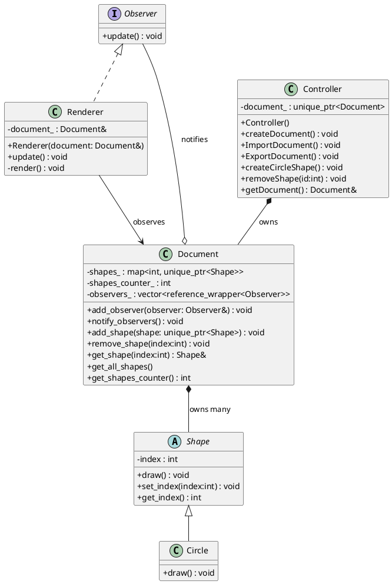

The diagram reflects the classes in:

- controller.hpp
- document.hpp
- shapes.hpp
- observer.hpp
- renderer.hpp

Use the PlantUML source below with any PlantUML renderer.

```plantuml
@startuml
skinparam classAttributeIconSize 0

interface Observer {
    +update() : void
}

abstract class Shape {
    -index : int
    +draw() : void
    +set_index(index:int) : void
    +get_index() : int
}

class Circle {
    +draw() : void
}

class Document {
    -shapes_ : map<int, unique_ptr<Shape>>
    -shapes_counter_ : int
    -observers_ : vector<reference_wrapper<Observer>>

    +add_observer(observer: Observer&) : void
    +notify_observers() : void
    +add_shape(shape: unique_ptr<Shape>) : void
    +remove_shape(index:int) : void
    +get_shape(index:int) : Shape&
    +get_all_shapes()
    +get_shapes_counter() : int
}

class Renderer {
    -document_ : Document&
    +Renderer(document: Document&)
    +update() : void
    -render() : void
}

class Controller {
    -document_ : unique_ptr<Document>

    +Controller()
    +createDocument() : void
    +ImportDocument() : void
    +ExportDocument() : void
    +createCircleShape() : void
    +removeShape(id:int) : void
    +getDocument() : Document&
}

Shape <|-- Circle
Observer <|.. Renderer

Controller *-- Document : owns
Document *-- Shape : owns many
Document o-- Observer : notifies
Renderer --> Document : observes

@enduml

```
